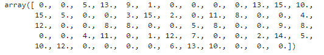
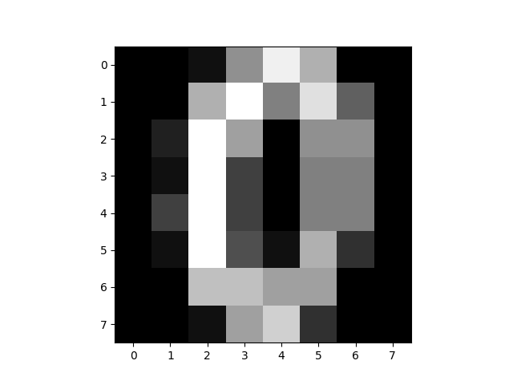
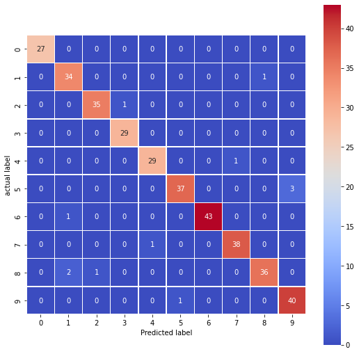

# Logistic Regression for Handwritten Digit Recognition

The goal of this project is to build and evaluate a logistic regression model to classify handwritten digits correctly. We'll load the digit dataset, split it into training and testing sets, train the logistic regression model, and evaluate its performance using a confusion matrix. The confusion matrix helps us understand the model's ability to classify digits accurately.

## Table of Contents

- [Introduction](#introduction)
- [Process](#process)
  - [Importing Libraries and Loading the Dataset](#import)
  - [Data Splitting and Logistic Regression Model](#model)
  - [Making Predictions and Creating a Confusion Matrix](#cm)
  - [Interpreting the Confusion Matrix](#interpret)

## [Introduction](#introduction)

This project focuses on using logistic regression to recognize handwritten digits. We'll leverage the popular digit dataset, which contains grayscale images of hand-drawn digits (0 to 9). Logistic regression is a suitable choice for this classification task, as it's well-suited for binary and multiclass classification problems.

## [Process](#process)

### [Importing Libraries and Loading the Dataset](#import)

In this step, we load the digit dataset, examine the structure of the first data point, and visualize it as an 8x8 grayscale image using Matplotlib. This step gives us an initial look at the dataset we're working with.

```python
import matplotlib.pyplot as plt
import seaborn as sns
import numpy as np

from sklearn.datasets import load_digits
from sklearn.linear_model import LogisticRegression
from sklearn.model_selection import train_test_split
from sklearn.metrics import confusion_matrix


digits = load_digits()

print(digits.data[0])
```



```python
image = np.reshape(digits.data[10], (8, 8))
print(image)

plt.imshow(image, cmap='gray')
```



### [Data Splitting and Logistic Regression Model](#model)

Here, we split the dataset into training and testing sets using train_test_split. The data is divided into features (x_train, x_test) and target labels (y_train, y_test). We then create a Logistic Regression model and train it on the training data.

```python
x_train, x_test, y_train, y_test = train_test_split(digits.data, digits.target, test_size=0.2, random_state=0)

logistic_reg = LogisticRegression().fit(x_train, y_train)
```

### [Making Predictions and Creating a Confusion Matrix](#cm)

In this step, we use the trained logistic regression model to make predictions on the test data (x_test). We then calculate a confusion matrix using confusion_matrix, which helps us assess the model's performance.

```python
y_pred = logistic_reg.predict(x_test)

cm = confusion_matrix(y_test, y_pred)

plt.figure(figsize=(9, 9))
sns.heatmap(cm, annot=True, linewidths=0.5, square=True, cmap='coolwarm')
plt.ylabel('Actual Label')
plt.xlabel('Predicted Label')
plt.show()
```



### [Interpreting the Confusion Matrix](#interpret)

The confusion matrix is a critical tool for evaluating the performance of classification models. It contains four important metrics:

- True Positives (TP): The number of correctly predicted positive instances.
- True Negatives (TN): The number of correctly predicted negative instances.
- False Positives (FP): The number of actual negatives incorrectly predicted as positive (Type I error).
- False Negatives (FN): The number of actual positives incorrectly predicted as negative (Type II error).

Using these metrics, we can interpret the confusion matrix as follows:

- Accuracy: (TP + TN) / (TP + TN + FP + FN)
- Precision: TP / (TP + FP)
- Recall (Sensitivity): TP / (TP + FN)
- F1-Score: 2 * (Precision * Recall) / (Precision + Recall)

Accuracy measures overall correctness, precision measures the correctness of positive predictions, recall measures the model's ability to capture positive instances, and the F1-score is a balance between precision and recall.

In summary, the confusion matrix helps us assess how well our logistic regression model classifies handwritten digits by providing insights into its true and false predictions for each class.